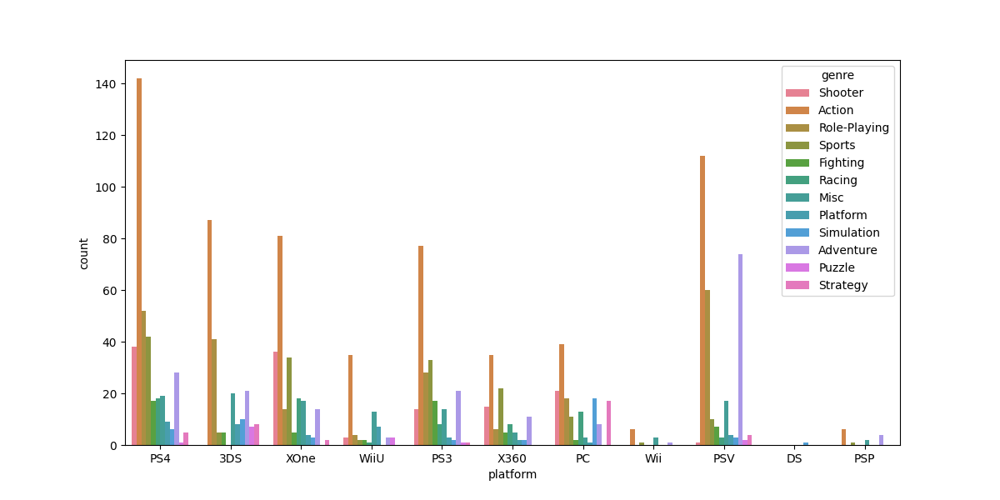
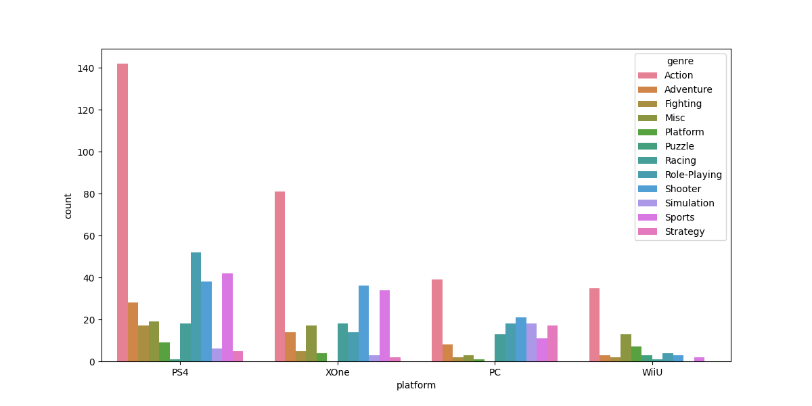

### Introduction to Data Ordering

This lesson builds upon the [previous lesson](course://Visualizing Data with Seaborn/Plotting Environment), 
where we introduced the basics of plotting with Seaborn using the same dataset. 
In that lesson, we created a graph without specific ordering for platforms or genres, which
made the visualization difficult to interpret. 

For instance, consider the graph shown below:

The focus of this lesson is on organizing data to enhance our visualizations and improve clarity. Properly organizing data is essential for highlighting trends and making comparisons easier, enabling us to refine our visualizations until we achieve a final, polished result.

### Ordering Data for Better Clarity

To enhance the interpretability of visualizations, it’s important to consider how data is presented. For example, in a count plot, sorting categories based on specific metrics can help viewers quickly understand insights.

- **Custom Ordering**: The `countplot` function in Seaborn allows you to specify the order of categories using the `order` parameter. This capability enables the logical arrangement of different categories based on relevant metrics, enhancing the clarity of the visualization.
- **Using `hue_order`**: In addition to ordering the x-axis, you can control the order of hue categories with the `hue_order` parameter. This ensures consistency across plots.

### Task: Implement Data Ordering in Count Plot

#### Objective

The objective of this task is to improve the previous count plot by implementing an ordering system for both gaming platforms and genres.

#### Steps to Follow

1. **Load the Dataset**: Begin by loading the dataset using the `load_data()` function provided in the previous lesson.

2. **Determine the Order of Platforms**: 
   - Focus on data regarding these four platforms: **PS4**, **XOne**, **PC** and **WiiU**.
   - Arrange the platforms in this specific order.

3. **Determine the Order of Genres**:
   - Sort genres alphabetically.
      

        Use the Python <a href="https://docs.python.org/3/library/functions.html#sorted">sorted()</a> function and the Pandas <a href="https://pandas.pydata.org/docs/reference/api/pandas.unique.html">unique()</a> function.
      

4. **Modify the Count Plot Code**:
   - Update the `sns.countplot()` function to include the `order` parameter for platforms and the `hue_order` parameter for genres.

5. **Display the Updated Plot**: 
   - Use `plt.show()` to render the modified count plot.
