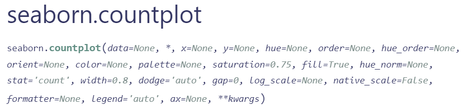

## Essentials of plotting with Seaborn

### Size of the Plot

Setting the plot size is an important first step in creating effective visualizations.
This ensures that your plots are easy to read and not too cramped or too spread out. 
You can define the plot's width and height in inches, 
which controls how large the final plot will appear on the screen.

In Python, the [plt.figure()](https://matplotlib.org/stable/api/_as_gen/matplotlib.pyplot.figure.html) function is used from Matplotlib (which Seaborn builds on) to set the plot size:

```
import matplotlib.pyplot as plt

plt.figure(figsize=(12, 6))
```
This code makes the plot 12 inches wide and 6 inches tall, giving enough room to display data.

### Types of Plots in Seaborn

Seaborn is a powerful library for making attractive, easy-to-understand plots. 
Here are a few common types of plots you might use:

- **[Bar Plot](https://seaborn.pydata.org/generated/seaborn.barplot.html)**: Shows the average (mean) or total (sum) value of a numerical variable for different categories. For example, you might use a bar plot to show average game sales for each platform.

    -  Example:
        ```python
        sns.barplot(x='x_data', y='y_data', data=data)
     ```
- **[Count Plot](https://seaborn.pydata.org/generated/seaborn.countplot.html)**: Displays how many times each category appears. It’s like a bar plot, but it counts the occurrences instead of showing averages.
    -  Example:
        ```python
        sns.countplot(x='x_data', hue='hue_data', data=data)
     ```

- **[Hist Plot](https://seaborn.pydata.org/generated/seaborn.histplot.html#seaborn.histplot)**: Breaks continuous data into "bins" (intervals) and shows how often data falls into each bin. This helps you understand the distribution of a dataset, like the spread of game prices.
    -  Example:
        ```python
        sns.histplot(data['attribute'])
     ```

<details>
  <summary> <strong>Explanation of Common Parameters in Seaborn Plots</strong> </summary>

  - **`x`**: The variable to be plotted along the x-axis. This can be categorical or numerical, depending on the type of plot.
  
  - **`y`**: The variable to be plotted along the y-axis. This is typically a numerical variable but can vary by plot type.
  
  - **`hue`**: An optional grouping variable that adds another dimension to the plot by splitting data into different colors based on the value of this variable.
  
  - **`data`**: The dataset you're using for the plot. Usually, this is a Pandas DataFrame that contains the variables specified in `x`, `y`, and `hue`.

  Example:
  ```
sns.barplot(x='platform', y='sales', hue='genre', data=data)
```
In this example:

- x='platform': Categories of platforms are on the x-axis.

- y='sales': The mean sales value for each platform is shown on the y-axis.

- hue='genre': Different genres are displayed in different colors.

- data=data: The dataset contains the columns platform, sales, and genre.
</details>


### Displaying the Plot

Once you've created your plot, you need to display it using  [plt.show()](https://matplotlib.org/stable/api/_as_gen/matplotlib.pyplot.show.html):

```python
import matplotlib.pyplot as plt

plt.show()
   ```

Using this command, the plot is rendered on your screen.


By doing this, the data story is presented visually, allowing users to engage with the story. 
## Task

In the upcoming task, 
the goal is to create a plot that illustrates the number of games available for all gaming platforms present in the dataset,
categorized by their respective genres. 

This visualization will help in understanding the distribution of games across different platforms
and how genres vary within each platform. 

It can be presumed that the data has been loaded correctly, ensuring an accurate representation of the information in the plot.

Set the size of the plot to 12 and 6 inches.


<div class="hint">

  A count plot is particularly suitable for our case
  because it effectively illustrates the frequency distribution of categorical variables.
  In our scenario, we are interested in visualizing the number of games
  across specific gaming platforms, while breaking down this data by genre.

  

</div>

<div class="hint">

  This function requires the categorical variable for the `x-axis`,
  such as **platform**, 
  and can use the `hue` parameter to add another dimension, like **genre**.

</div>

  


